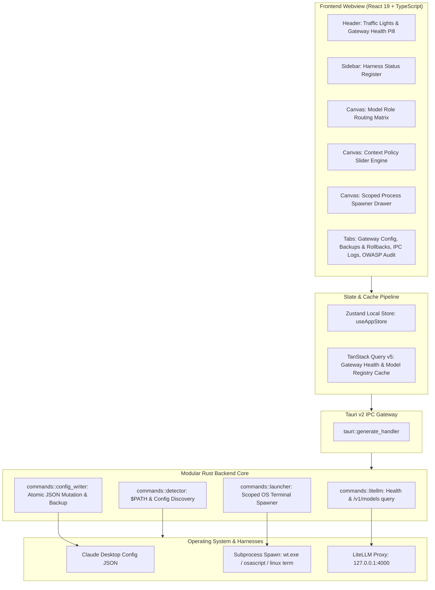

# Architecture & Technical Design: LiteBridge Desktop (v1.0.0-MVP)

## 1. High-Level Architecture

LiteBridge Desktop is designed as a secure, low-latency desktop orchestrator that bridges developer CLI agent harnesses with LiteLLM proxy clusters. Built using **Tauri v2**, **Rust**, **React 19**, and **Tailwind CSS**, it enforces strict process isolation and OWASP Top 10 mitigations.



---

## 2. Directory Structure

```
LiteBridge-Desktop/
├── .github/
│   └── workflows/
│       └── build.yml               # Multiplatform matrix CI (macOS, Windows, Ubuntu)
├── docs/
│   ├── ARCHITECTURE.md             # System architecture & IPC design
│   └── SECURITY_OWASP.md           # Comprehensive OWASP Top 10 mitigation audit
├── src-tauri/
│   ├── Cargo.toml                  # Tauri v2, Tokio, Reqwest, Serde dependencies
│   ├── build.rs                    # Tauri build orchestrator
│   ├── tauri.conf.json             # Window config, security & permissions
│   ├── icons/                      # Multiplatform icon assets (ICO, ICNS, PNGs)
│   └── src/
│       ├── lib.rs                  # Plugin registration & IPC handler dispatch
│       ├── main.rs                 # Win32 subsystem entry point
│       └── commands/
│           ├── mod.rs
│           ├── litellm.rs          # /health probe & /v1/models parser
│           ├── detector.rs         # $PATH scanner & platform config resolver
│           ├── config_writer.rs    # Atomic JSON merge, backup & rollback
│           └── launcher.rs         # Scoped terminal spawner (macOS, Windows, Linux)
├── src/
│   ├── components/
│   │   ├── Header.tsx              # Native titlebar & gateway status pill
│   │   ├── Sidebar.tsx             # Agent status rail & route selector
│   │   ├── OrchestratorCanvas.tsx  # Role matrix, context policies & launch drawer
│   │   ├── GatewayConfigView.tsx   # LiteLLM connection & key manager
│   │   ├── BackupsView.tsx         # Config snapshots & 1-click restore
│   │   ├── IpcLogsView.tsx         # Real-time IPC event monitor
│   │   └── SecurityAuditView.tsx   # Visual OWASP checklist
│   ├── hooks/
│   │   └── useTauriBridge.ts       # TanStack Query v5 + safe Tauri IPC invoker
│   ├── store/
│   │   └── useAppStore.ts          # Zustand state management
│   ├── types/
│   │   └── index.ts                # TypeScript domain models
│   ├── test/
│   │   ├── setup.ts
│   │   ├── store.test.ts           # Vitest unit tests for Zustand state
│   │   └── components.test.tsx     # Vitest DOM tests for components
│   ├── App.tsx
│   ├── main.tsx
│   └── index.css                   # Tailwind CSS dark theme design tokens
├── PRD.md                          # Product Requirements Document
├── README.md                       # Installation and usage guide
└── CONTRIBUTING.md                 # Extension guide for CLI harnesses
```

---

## 3. IPC Commands Reference

| Command Name | Module | Description |
|---|---|---|
| `check_litellm_health` | `litellm.rs` | Probes `GET /health` with timeout and returns latency in ms. |
| `fetch_litellm_models` | `litellm.rs` | Fetches `GET /v1/models` and extracts active upstream model identifiers. |
| `scan_system` | `detector.rs` | Scans host `$PATH` for binaries and checks `claude_desktop_config.json`. |
| `mutate_claude_desktop_config`| `config_writer.rs` | Non-destructively merges gateway settings into Claude Desktop JSON with automatic backup. |
| `list_config_backups` | `config_writer.rs` | Lists timestamped `.bak.<timestamp>` files with creation date and size. |
| `rollback_config_backup` | `config_writer.rs` | Validates and restores a selected backup snapshot. |
| `launch_scoped_terminal` | `launcher.rs` | Spawns an isolated terminal emulator process with injected runtime environment variables. |

---

## 4. Zero-Pollution Subprocess Isolation

Unlike traditional scripts that append to `~/.bashrc` or modify Windows system registry entries, LiteBridge injects runtime variables solely into the spawned process handle:

- **macOS:** Dispatches via `osascript` into Terminal.app or iTerm2 with an ephemeral `export ...;` prefix.
- **Windows:** Invokes `wt.exe` or `powershell.exe -NoExit -Command "$env:...; & '...'"` passing variables directly to the process environment block.
- **Linux:** Launches the detected terminal (`x-terminal-emulator`, `gnome-terminal`, `kitty`, etc.) with `export ...; exec $SHELL`.
